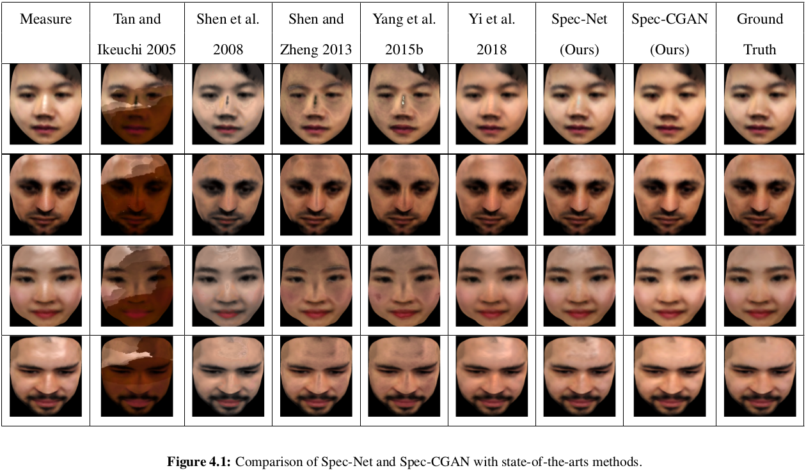

# Spec-Face and SPEC-CGAN
The human face plays a very important role in this world.Sometimes, faces may not be captured properly, due to high specularity or low illumination. If so, we may not recognize them accurately later. If we could convert low-quality images to high-quality images prior to storage, we may be better prepared to recognize them accurately later in applications such as
face detection or recognition. To perform this conversion through machine learning models, we need real-world training datasets that contain faces corrupted by specularity, along with ground truth diffuse faces. Unfortunately, today, there is no real-world face dataset that contains faces with specularity and corresponding ground truth diffuse images.

Therefore, in this paper, one of the focal points is creating datasets that contain faces with specularity and corresponding ground truth diffuse images. I have created three datasets. The Spec-Face dataset consists of face images with specularity and corresponding ground truth diffuse images.

I also introduce two deep learning models, namely Spec-Net (Will be uppload soon) and Spec-
CGAN, to remove specularity from face images. Spec-CGAN is the first use of GANs for removing specularity from images, specifically face images. I test different variations of the GAN approach namely Simple-GAN, Spec-CGAN, Cycle-GAN-SSIM, Cycle-GAN-and-SSIM, and Cycle-GAN-Per-loss, and I find that Spec-CGAN performs better than other variations and consider it for further evaluation.

<ul>
  <li> The dataset (Spec-Face) avalible free only for non-commercial research and education purposes </li>
  <li> Any portion thereof, will not be copied, sold, traded or exploited for any commercial purposes </li>
  
  <li> No one is allowed to edit the dataset </li>
</ul>

## Qualitative Results
<p align="center">
  
</p>

## Prerequisites 
<ul>
  <li>tensorflow r1.1 </li>
  <li>numpy 1.11.0 </li>
  <li>scipy 0.17.0 </li>
  <li>pillow 3.3.0 </li>
</ul>

## Installation 
<ul>
  <li> Install tensorflow from https://github.com/tensorflow/tensorflow </li>
  <li> Clone this repo: </li> 
</ul> 

```
  git clone https://github.com/msiraj83/SPEC-CGAN.git
  cd SPEC-CGAN
```
## Train
<ul>
  <li> Download the dataset (datasets.tar.gz) from the follwoing google drive link, extract and place it into SPEC-CGAN directory. </li>
  
  ```
  https://drive.google.com/drive/u/1/folders/1ikWkAmdGN2d_MAhzRGvLkFNWLhzFHS1o
  ```

  <li> Download the dataset (spec2diff_with_mask.zip) with specular mask from the follwoing google drive link, extract and place it into SPEC-CGAN/datasets directory </li>
  
  ```
  https://drive.google.com/file/d/1n3z4FP57rly--VHocptRldaOAXRvrlxE/view?usp=sharing
  ```

  <li> Train a model: </li>
  
  ```
   CUDA_VISIBLE_DEVICES=0 python SPEC_CGAN_main.py --dataset_dir=spec2diff
  ``` 
  <li> Use tensorboard to visualize the training details: </li> 
  
  ```
   tensorboard --logdir=./logs
  ```
</ul>

## Test the model
<ol>
  <li> Download the pre-trained model (checkpoint.tar.gz) from the following google drive links, extract and place it into SPEC-CGAN directory</li>
  
  ```
   https://drive.google.com/drive/u/1/folders/1ikWkAmdGN2d_MAhzRGvLkFNWLhzFHS1o
  ```
  
  <li> Run the follwoing command </li>
  
   ```
   CUDA_VISIBLE_DEVICES=0 python SPEC_CGAN_main.py --dataset_dir=spec2diff --phase=test --which_direction=AtoB
  ```  
  <li> If you want to run the model for your own images, then keep your images in ./Dataset/testA/ folder and run the command in sep no 2. </li>
  
</ol>
  
## Citetation of face from testA
Please cite only the faces with following names in your paper.
<ul>
  <li>Chaphan_*.png </li>
  <li>Siraj_*.png </li>
  <li>petch_*.png</li>
  <li>st119573_*.png </li>
  <li>st119818_*.png </li>
</ul>

## Reference
<ul>
  <li> Muhammad, S., Dailey, M. N., Farooq, M., Majeed, M. F., & Ekpanyapong, M. (2019). Spec-Net and Spec-CGAN: Deep learning models for specularity removal from faces. Image and Vision Computing, Volume(39), 103823.  https://www.sciencedirect.com/science/article/pii/S0262885619304160 </li>
</ul>
